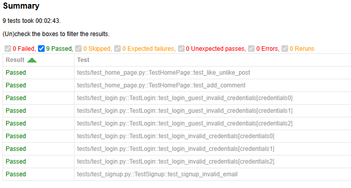

## Screenshot




# Introduction 
This is a small demo project of automated tests for Instagram’s web UI (login, sign-up, basic feed checks). 

This project is written with:
 - **Python**;  
 - ***Selenium***;
 - ***Pytest***;

and implements Page Object Model pattern.

# Requirements
- IDE for Python (for example PyCharm)
- Python 3.x
- Google Chrome (Selenium 4 will manage the driver automatically)
- Instagram test account (if you want to actually log in / sign up)

# Installation
Once you have cloned the project from the remote repository:
```git clone https://github.com/andriy-metelsky/test.git```

please install the needed packages:  
 ```pip install -r requirements.txt```  

# Run Tests
All tests can be executed directly from Pycharm by clicking Run button, 

or from CLI via the Pytest command:  
```pytest -v```  

To execute a specific test package, the path to it should be provided to the command:  
```pytest -v tests/test_login.py```

To execute a test with custom marker:  
```pytest -v -m 'login'```

# Config
You can adjust credentials for Instagram account in config.py. 
Dummy email and password are used for the moment to avoid sharing the candidate’s personal data with interviewers.

